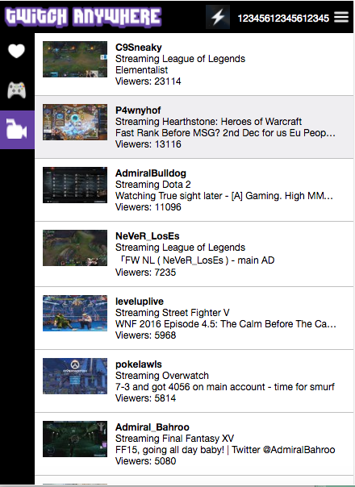

# Twitch Anywhere

[Live link][git]
[git]: https://chrome.google.com/webstore/detail/twitch-anywhere/ncnpbpmedijfhnahjkgnmmaphdalhfle?hl=en-US

Twitch Anywhere is a Google Chrome extension built using JavaScript with React and Redux. This extension allows you to look at who is streaming on Twitch.tv from any website.


## Features and Implementation


### Twitch API
This extension makes calls to Twitch's API to generate all of its data. It accomplishes this through AJAX requests and then parses the data for display. Currently you can see the top games on Twitch and see the top streams for each game. You can also view your followed streams to see if any of the streamers are live, and you can see the top overall streams on Twitch by viewer count.

```JavaScript
$.ajax({
  method:'GET',
  url: 'https://api.twitch.tv/kraken/games/top?limit=100',
  headers: {
    'Client-ID': 'My Client ID'
  },
  success
});
```




### User Authentication
User authentication is achieved using Twitch's API in conjunction with Google Chrome's API. When the user clicks on the connect to twitch button, they are redirected to Twitch's OAuth2 link to authorize this extension to access the user's data in a new Chrome tab. If the user allows authorization, Twitch's API will redirect them to a preset OAuth2 redirect URL which I have set to chromiumapp.org/extensionIdHere with the user's access token in the query string of the redirect URL.

```JavaScript
chrome.tabs.onUpdated.addListener(function(tabId, changeInfo, tab) {
  let url = tab.url;
  if(url.includes('https://<extensionid>.chromiumapp.org/#access_token=')){
    chrome.storage.sync.set({'TwitchAnywhereToken': url.match(/access_token=([^&]*)/)[1]});
    chrome.tabs.remove(tabId);
  }
});
```
In order to grab this url, I use a chrome.tabs event listener in a Chrome extension background page to look for the specific redirect URL link, grab the access token using regex, and save the access token using chrome.storage.sync to save it to browser. I chose to use sync over storage.local so users can be authorized across different computers as long as they are signed into their google account. This token is loaded if it exists in the Chrome storage upon start of the extension so the user does not have to authorize again for future sessions. I then close this tab that leads to nowhere so that the user does not have a useless tab open in their browser. While there is no Twitch API call to revoke access to the app, I added a logout feature in the case of multiple users per computer.


## Future Features

### More tabs
Make further use of Twitch's api to add more features for the user. A good example is using Twitch's search API call to allow for users to search for streams, channels, etc.

### Notifications
Add notifications for the followed streams so that when a followed streamer starts streaming, the icon will update in the browser as well as a notification message for the user.  

### More user customization
Allow the user more control over the app. Maybe they don't want it to open the stream in a new tab but in a pop window instead. Also right now the default tab is set to Top Games but in the future I'd like the user to select which tab they want as default.
